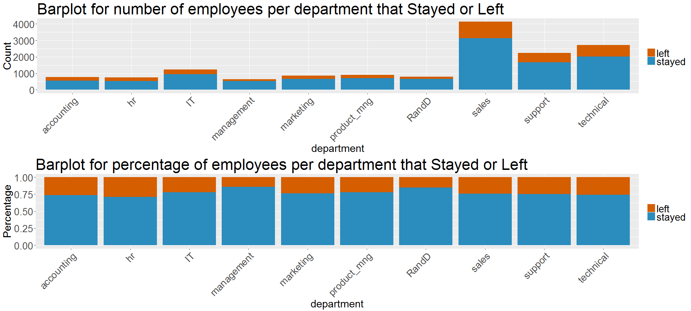
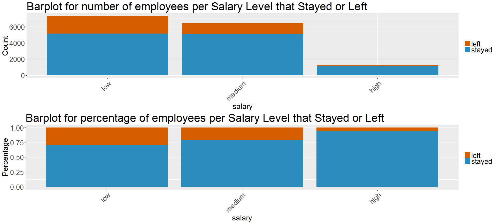
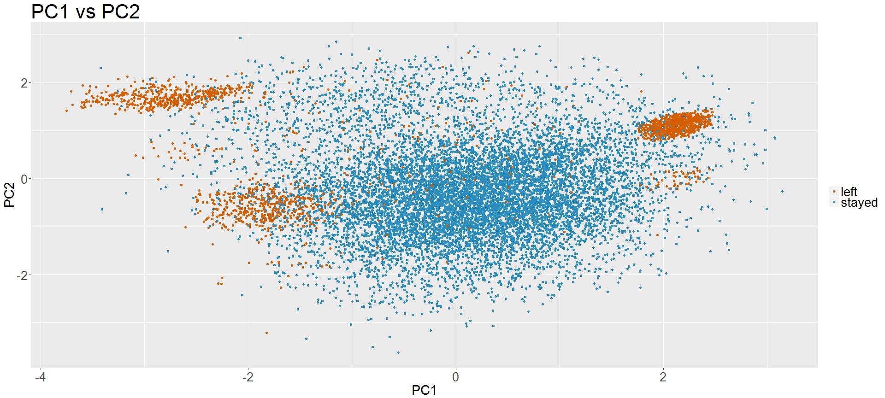
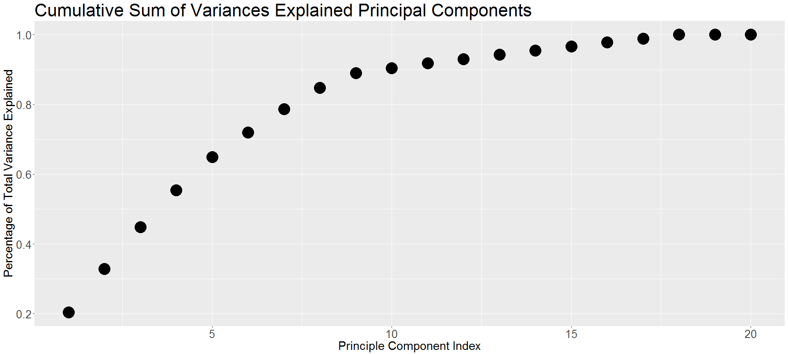

Course 02450 - Introduction to Machine Learning Project 1 - Exploratory Data Analysis
================
28 February 2017

-   [1 Introduction](#introduction)
-   [2 Descriptive Statistics](#descriptive-statistics)
    -   [2.1 Histograms for Numerical Variables](#histograms-for-numerical-variables)
    -   [2.2 Boxplots for Numerical Variables](#boxplots-for-numerical-variables)
    -   [2.3 Barplots for Categorical Variables](#barplots-for-categorical-variables)
    -   [2.4 Tables for Binary Variables](#tables-for-binary-variables)
    -   [2.5 Correlation plot](#correlation-plot)
    -   [2.6 Correlation of all variables with the "left" variable](#correlation-of-all-variables-with-the-left-variable)
-   [3 Principal Component Analysis](#principal-component-analysis)
-   [4 Discussion](#discussion)

1 Introduction
==============

The dataset to be analyzed for this report is Human Resources data from Kaggle. It is a simulated dataset without containing any missing values or outliers. It contains 14999 observations that are employees of a company and has 10 variables describing the characteristics of these employees. These characteristics are shown in the table below:

<table>
<colgroup>
<col width="23%" />
<col width="57%" />
<col width="18%" />
</colgroup>
<thead>
<tr class="header">
<th align="center">Variable Name</th>
<th align="center">Description</th>
<th align="center">Type</th>
</tr>
</thead>
<tbody>
<tr class="odd">
<td align="center">Satisfaction Level</td>
<td align="center">Level of satisfaction of the employee</td>
<td align="center">Continous, ratio</td>
</tr>
<tr class="even">
<td align="center">Last evaluation</td>
<td align="center">Evaluation of employee performance</td>
<td align="center">Continous, ratio</td>
</tr>
<tr class="odd">
<td align="center">Number Project</td>
<td align="center">Number of projects completed while at work</td>
<td align="center">Discrete, ratio</td>
</tr>
<tr class="even">
<td align="center">Average monthly hours</td>
<td align="center">Average monthly hours at workplace</td>
<td align="center">Discrete, ratio</td>
</tr>
<tr class="odd">
<td align="center">Time spend company</td>
<td align="center">Number of years spent in the company</td>
<td align="center">Discrete, ratio</td>
</tr>
<tr class="even">
<td align="center">Work accident</td>
<td align="center">Whether the employee had an accident or not</td>
<td align="center">Discrete, nominal</td>
</tr>
<tr class="odd">
<td align="center">Promotion last 5years</td>
<td align="center">Whether the employee was promoted in the last five years</td>
<td align="center">Discrete, nominal</td>
</tr>
<tr class="even">
<td align="center">Left</td>
<td align="center">Whether the employee left the workplace or not</td>
<td align="center">Discrete, nominal</td>
</tr>
<tr class="odd">
<td align="center">Department</td>
<td align="center">Departments in the company</td>
<td align="center">Discrete, nominal</td>
</tr>
<tr class="even">
<td align="center">Salary</td>
<td align="center">Salary level of the employee</td>
<td align="center">Discrete, ordinal</td>
</tr>
</tbody>
</table>

Our aim is to model whether an employee will leave the company or not by using machine learning methods. For supervised learning, the primary machine learning method can be logistic regression as it is mainly used for classification of binary variables. This fits our aim perfectly but tree-based methods can also be used for classification of whether the employee will leave the company or not. In any case, we will need all the variables in our dataset to perform the analysis.

For unsupervised learning, the primary machine learning method can be clustering to be able to identify different characteristics of employees, which a priori could be groups like 'high performers' and 'low performers', 'senior management' or 'newcomers' that will actually contribute to the supervised learning method chosen. We will again use all the variables in our dataset to be able to obtain employees with similar behaviours.

For linear regression, we can try to predict numerical outcomes of employee characteristics such as the satisfaction level of the employee based on the score from the last evaluation or on average monthly hours he is working.

For the tasks mentioned above, our raw data can't be used directly. We have two categorical variables containing more than two categories such as the department of the employee, so we need to use one-out-of-k coding to transform these variables into several binary variables. This is necessary to be able to incorporate all our variables in the principal component analysis. We also need to normalize our variables by subtracting the mean from each variable and dividing by its standard deviation. This is a necessary step as our numerical variables have difference in scale. The newly created binary variables created from one-out-of-k coding should also be penalized according to the number of categories created to prevent the increase of variable effect on the principal component analysis.

2 Descriptive Statistics
========================

A first look at the variables with the "summary" command in R can be seen in the below tables. It's a good way to spot potential problems and gives a rough idea about the whole data frame. As the dataset has already been clean from the start, we didn't notice any particular problems such as invalid values or obvious outliers.

    ##  satisfaction_level last_evaluation  number_project  average_montly_hours
    ##  Min.   :0.0900     Min.   :0.3600   Min.   :2.000   Min.   : 96.0       
    ##  1st Qu.:0.4400     1st Qu.:0.5600   1st Qu.:3.000   1st Qu.:156.0       
    ##  Median :0.6400     Median :0.7200   Median :4.000   Median :200.0       
    ##  Mean   :0.6128     Mean   :0.7161   Mean   :3.803   Mean   :201.1       
    ##  3rd Qu.:0.8200     3rd Qu.:0.8700   3rd Qu.:5.000   3rd Qu.:245.0       
    ##  Max.   :1.0000     Max.   :1.0000   Max.   :7.000   Max.   :310.0       
    ##                                                                          
    ##  time_spend_company     Work_accident    promotion_last_5years
    ##  Min.   : 2.000     no accident:12830   not promoted:14680    
    ##  1st Qu.: 3.000     accident   : 2169   promoted    :  319    
    ##  Median : 3.000                                               
    ##  Mean   : 3.498                                               
    ##  3rd Qu.: 4.000                                               
    ##  Max.   :10.000                                               
    ##                                                               
    ##        department      salary    
    ##  sales      :4140   low   :7316  
    ##  technical  :2720   medium:6446  
    ##  support    :2229   high  :1237  
    ##  IT         :1227                
    ##  product_mng: 902                
    ##  marketing  : 858                
    ##  (Other)    :2923

2.1 Histograms for Numerical Variables
--------------------------------------

 The first histogram on the uppermost left shows the satisfaction level distribution of the employees. The shape of the distribution doesn't represent a normal distribution but rather shows bimodal characteristic. The first peak is clustered around a satisfaction level from 0.00-0.10 while a second peak is clustered between 0.4-0.9, evenly distributed across the specified range representing almost 77 percent of the workforce.

The histogram on the uppermost right shows the score of the employees' last evaluation and again the shape of the distribution is bimodal.The twin peaks indicates a low performing group of with score around 0.55 and a high performing group around 0.85 while many employees fall between the two groups.

The third histogram in the middle on the left side shows the distribution of the number of projects employees completed while at work and is almost normally distributed while a bit skewed to the right. It shows that the majority of the employees have 2-4 project in their portfolio.

The fourth histogram on the lowermost right shows the monthly average hours of the employees' and again the shape of the distribution is bimodal.The twin peaks indicate a employees working 145 on average and 253 hours on average.

Lastly, the distribution of the years at company present itself as a Poisson distribution, which could make good sense if the firm is hierarchically structured where a lot of employees is used in the 'bottom of the pyramid' and fewer and fewer employees are used as they move up in the hierarchy.

2.2 Boxplots for Numerical Variables
------------------------------------

To describe and visualize the distribution of our data in further detail, we present boxplots of our numerical variables in standardized scale, which is necessary due to otherwise difference in scale. In order to distinguish between employees who left and those who did not, the data is then split into the appropriate groups. This way, we will be able to derive specific variables that changes depending upon who left or not and thereby indicate which variables that primarily affects the prediction of an employee's future in the company.

If we look at the first set of boxplots, the first four numerical variables seem to be almost identically distributed. The difference in these four variables primarily stems from the different variance in the first quantile and after the third quantiles. We can also see that the time spent at the company has a compact distribution, where there is no difference between the second quantile and the median. This make sense, because as we mentioned earlier more than 40 percent of the employees have been in the company for exactly three years. Furthermore, time spent at company is the only variable that we can observe outliers according to the boxplots.

 If we look at the second set of boxplots above we can see that there is a difference in distribution on the satisfaction level, the number of projects and the time spent at company based on whether the employee left the company. The median of the satisfaction level is much lower of the group who left and the variation between the first and third quantile is much larger compared to the group who stayed at the company. This makes perfect sense, and supports our hypotheses of the satisfaction level as one of the main reasons for why employees leave the company.

When we observe the number of projects completed by the employees, we can see that the median stays the same for employees who left or stayed. However, there is higher variation in the first and third quantiles for the employees who left compared to the employees who stayed.

Finally, if we compare the box plots showing the time spent at the company, we can see that employees who left the company in general have been working for a longer period than the people who stayed. This can be seen by both the first quantile, the median and the third quantile as they are shifted upwards for the people who left.

2.3 Barplots for Categorical Variables
--------------------------------------

The barplots below represent the categorical variables that have more than two levels. The first two barplots show the number of people in each department who stayed or left and the precentage of the people in each department who stayed or left. The same logic is applied to the salary levels of the employees. The reason of this kind of visualization is to compare the total number of people in each category along with the comparison of percentage of people that left among each category as an indication of a reason for leaving the company.

It can be seen from the graphs that the departments vary in size, ranging from the sales department with more than 4140 employees to management that have had 617 employees. Furthermore the graphs show that the share of employees who have left the company is largest in the HR department with almost 30 percent , whereas the share is smallest in the management department, where 14 percent of the employees left their job.

If we look at the salary level comparison, a clear tendency appears when employees receive a low salary. This tendency is validated by the opposite behaviour when the salary is higher.

2.4 Tables for Binary Variables
-------------------------------

The following two tables shows the percentages of the empoyees who have left or stayed for each of the other binary variables:

    ##         
    ##          no accident accident
    ##   stayed       62.86    13.33
    ##   left         22.68     1.13

    ##         
    ##          not promoted promoted
    ##   stayed        74.19     2.00
    ##   left          23.68     0.13

From the tables we can see that emplyees show a tendency to stay when when they have had an accident and employees who get promoted tend to stay at the firm in comparison to the ones who are not promoted. A more interesting observation in the first table is that one third of the employees who hasn't experienced any accidents tend to leave the company while this ratio falls to almost one twelfth for the ones who experienced an accident at work. This gives an idea about the company's positive approach to the employees after they received an accident. When we look at the second table, we can again see that approximately one third of the employees who are not promoted tend to leave the company while this ratio falls to almost one twntieth for employees who are promoted. This is an expected behaviour for employees to stay in the company for some more time after they receive the promotion.

2.5 Correlation plot
--------------------

The correlation matrix below was plotted to visualize any possible linear relationship between numerical variables. Due to the fact that there are a high number of observations, the color code isn't perfectly visible in the limited area of the plot but they are more visible when zoomed in:  The satisfaction level plotted against last evaluation shows three groups very likely to leave; two groups which have high scores in their last evaluation and one group which has low. The two high scoring groups are split by satisfaction level as one group finds high satisfaction while the other finds moderate satisfaction at work. The low scoring group in their last evaluation find little to none satisfaction at the company. The satisfaction level and the number of projects doesn't show a clear correlation but it can be seen slightly that employees with high number of projects completed tend more to leave. A higher correlation can be seen between satisfaction level and the average monthly hours with employees that have high working hours with high satisfaction or employees with low working hours and low satisfaction tend to leave the company. Time spent at company show a positive correlation with the satisfaction until five years and this correlation doesn't follow employees with higher number of years spent at company.

The last evaluation and number of projects worked show that the employees that got high scores in their last evaluation working on high number of projects or people that got low scores in their last evaluation working on low number of projects tend to leave the company. This correlation can be explained by being ready to take a new career step or not being happy with the current job at all. A similar relationship is more obvious between last evaluation score and average monthly hours. Employees with high working hours that got high scores in their latest evaluation and employees with low working hours that got low scores in their evaluation tend to leave the company. Finally, up to five years of experience in the company, employees with high and low end scores of last evaluation tend to leave the company. Employees don't tend to leave company after five years.

In the plot between the number of projects and average monthly hours, we can see a positive correlation between the two variables. This means that employees who completed higher number of projects with high working hours tend to leave the company, whereas it isn't easy to show a correlation between number of projects and time spent at company.

Finally, average monthly hours and time spent at company show a positive correlation again up to five years of employment which shows that the more experience an employee has, the more he tends to leave. If the employee stays in the company longer, this relationship is no longer valid.

2.6 Correlation of all variables with the "left" variable
---------------------------------------------------------

The linear correlation between all the variables and the "left" variable can be seen in the below table. The function "cor" is used in programming with R which returns the Pearson correlation coefficient that can be used as a measure of linear correlation in our case. This resulted in the dataframe below, listing the variables from the highest absolute value of correlation coefficient to the lowest:

|       Variable Name       | Correlation Coefficient |
|:-------------------------:|:-----------------------:|
|    satisfaction\_level    |         -0.3884         |
|       Work\_accident      |         -0.1546         |
|    time\_spend\_company   |          0.1448         |
|         sal.is.low        |          0.1347         |
|        sal.is.high        |         -0.1209         |
|  average\_monthly\_hours  |          0.0713         |
|       sal.is.medium       |         -0.0688         |
| promotion\_last\_5\_years |         -0.0618         |
|        dep.is.RandD       |         -0.0466         |
|     dep.is.management     |         -0.0460         |
|         dep.is.hr         |          0.0282         |
|      number\_project      |          0.0238         |
|      dep.is.technical     |          0.0201         |
|     dep.is.accounting     |          0.0152         |
|    dep.is.product\_mng    |         -0.0110         |
|         dep.is.IT         |         -0.0109         |
|       dep.is.support      |          0.0107         |
|        dep.is.sales       |          0.0099         |
|      last\_evaluation     |          0.0066         |
|      dep.is.marketing     |         -0.0009         |

As can be seen from the table, satisfaction level negatively correlates with the tendency to leave the company. This is an expected relationship when a direct linear relationship is considered for the employees. However, the number of accidents when considered on its own shows a negative correlation with the employees' tendency to leave. When an employee experiences a work accident, he tends to stay in the company. This might indicate the company has good way to handle accidents that convince the employees to stay in the company longer.

Similar outcome can be said about the other variables according to their correlation coefficient in the above table but this doesn't mean that we need to neglect any variable based on their correlation with leaving or staying in our analysis. The variables might contribute to a better relationship in combination with other variables. We will try to seek out these relationships in our principal component analysis.

3 Principal Component Analysis
==============================

The principal component analysis was used to analyze whether we can find a lower-dimensional representation of our dataset although there are 10 variables in the dataset as a beginning point. These variables have difference in scale so the data set needs to be standardized by subtracting the mean of each variable from each observation of that variable and then by dividing by the standard deviation of that variable.

This method of standardization can be applied to numerical variables and even to the binary variables once they are coded as having a value of either 0 or 1. However, for our categorical variables that have more than 2 levels, we used one-out-of-k coding where we mapped our department variable into ten binary variables and our salary variable into three binary variables.Then, we penalized the observations in these newly created binary variables by dividing them by the square root of the number of new binary variables, which mean that the observations in the newly created department binary variables are divivded by square root(10) and the newly created salary binary variables are divided by square root(3) after they are standardized.

Once our data set is standardized for all the variables and new variables added, we ended up with a data set of 20 variables. Now, we need to obtain a subspace where we can project our dataset where the explanation of variability is maximized so that there is a possibility of finding a lower-dimensional representation. The orthonormal eigenvectors with the largest eigenvalues will solve this maximization problem, so we applied singular value decomposition to compute the eigenvectors with correspoding eigenvalues. The singular value decomposition returns three matrices; a diagonal matix with rank ordered set of singular values, *ϵ*, and two matrices containing singular vectors, U and V. The matrix V is the matrix containing right singular vectors and our dataset was projected on to the principal components by multiplying it with the matrix V. The variable order of our projected dataset along with principal component directions for PC1 and PC2 can be seen below:

|       Variable Name       |      PC1      |     PC2    |
|:-------------------------:|:-------------:|:----------:|
|    satisfaction\_level    |  0.0877264957 | -0.7947630 |
|      last\_evaluation     | -0.5068741120 | -0.3231416 |
|      number\_project      | -0.5787401115 |  0.1054799 |
|  average\_monthly\_hours  | -0.5488515541 | -0.0972323 |
|    time\_spend\_company   | -0.3138610900 |  0.2577985 |
|       work\_accident      |  0.0191985080 | -0.3875204 |
| promotion\_last\_5\_years | -0.0105679628 | -0.1521692 |
|     dep.is.accounting     | -0.0014274743 |  0.0088775 |
|         dep.is.hr         |  0.0058683897 |  0.0034956 |
|         dep.is.IT         | -0.0006845824 |  0.0007312 |
|     dep.is.management     | -0.0086933252 | -0.0017470 |
|      dep.is.marketing     |  0.0026368420 | -0.0047328 |
|    dep.is.product\_mng    |  0.0010630014 |  0.0000632 |
|        dep.is.RandD       |  0.0009113525 | -0.0056449 |
|        dep.is.sales       |  0.0029320930 |  0.0025425 |
|       dep.is.support      |  0.0006197088 | -0.0058293 |
|      dep.is.technical     | -0.0042139116 |  0.0018626 |
|         sal.is.low        |  0.0043302419 |  0.0440945 |
|       sal.is.medium       | -0.0061719555 | -0.0346875 |
|        sal.is.high        |  0.0032386792 | -0.0176996 |

If we observe PC1; it can be seen that high values of the last evaluation, number of projects, average monthly hours and time spent at the company will have a negative projection on PC1 more predominantly than the other variables. In that sense, PC1 seems to describe the behaviour of the experienced individuals who have performed well in their last evaluation and have been managing a high number of projects with a high amount of working hours.

If we observe PC2, it can be seen that high values of the satisfaction level, last evaluation and work accident a negative projection on PC2 whereas high values of time spent at the company will have positive projection on PC2. In that sense, PC2 seems to describe the high performing individuals who are actually happy with the conditions but experienced a work accident.

The projected data on PC1 and PC2 can be seen below to provide the relationship more visually:

 It can be seen from the graph that the observations for individuals who leave or stay show differences which is a good indication that classification is feasible. However, not only two principle components could be enough to make a classification on the whole dataset. That's why, an analysis on the amount of variation explained by each principal component was made. It can be seen below in percentage rounded to 2 decimal points:

|   PC1  |   PC2  |   PC3  |   PC4  |  PC5 |  PC6  |  PC7  |  PC8  |  PC9  |  PC10 |
|:------:|:------:|:------:|:------:|:----:|:-----:|:-----:|:-----:|:-----:|:-----:|
| 20.34% | 12.54% | 11.92% | 10.67% | 9.4% | 7.09% | 6.72% | 6.08% | 4.26% | 1.46% |

|  PC11 |  PC12 |  PC13 |  PC14 |  PC15 |  PC16 |  PC17 |  PC18 |  PC19 |  PC20 |
|:-----:|:-----:|:-----:|:-----:|:-----:|:-----:|:-----:|:-----:|:-----:|:-----:|
| 1.33% | 1.25% | 1.20% | 1.18% | 1.17% | 1.17% | 1.17% | 1.07% | 0.00% | 0.00% |

The cumulative sum of variances explained by the principal components is plotted in the below figure:

 It can be seen from the values provided and the plot that the last 2 principal components doesn't explain much about the variance of our dataset whereas the first 5 principal components explain more than 60% of the total variance. Moreover, the last 11 principal components add up to approximately 10 percent This means that there is a possibility of lowering the dimensionality of the dataset based on how much variance we will prefer to drop.

4 Discussion
============

The proposed aim was to predict whether an employee is likely to stay or leave the company based on the other variables in the dataset as stated in the introduction. To get information about all the variables given, a descriptive statistical analysis was performed.

Initially, it was seen that the company has a big sales force with technical and support departments as big parts of the total number of employees. There are differences in salary levels and most of the employees are considered to be in the low salary level. The ones with low salaries tend to leave the company compared to the ones with high salary. One sixth of the employees experienced work accidents but it was interesting to see that from the portion of employees who had an accident, most of them preferred to stay in the company. Another observation was that only a small portion of the employees that got promoted in the last five years tended to stay.

It was also seen that employees' satisfaction levels, their scores on the last evaluation and the hours they work on a monthly basis show a bimodal distribution and are gathered around two peaks for each of these variables. From these observations, it may be reasonable to assume two different types of behavior for employees for each variable. In more general terms, there are employees that are either happy or unhappy about their current job, there are employees that perform either high or low in their evaluation and there are employees that either work high or low amount of hours per month. The number of projects that employees completed show a more uniform distribution which shows that most of the employees have worked on same number of projects and consequently this is also shown by the distribution of the years at company where most employees have an experience of three years. It is a fair statement to say that employees complete around four projects in three years in general.

When we compared these behaviour of employees for the ones who left and who stayed, we also observed a higher variance for the once who left the company. Another observation was a decrease in median of satisfaction levels for the employees who left whereas there is an increase in median of the last evaluation score, average monthly hours and time spent at the company. Concerning the satisfaction level, we saw that it is the variable that correlates the most with whether an employee will leave or stay at the company. In that sense, the satisfaction level is considered to be one of the most important deciding factors when predicting if an employee will leaeve or not.

These observations show that groups of employees show very distinctive characteristics all around the company. It is a good indication for our aim and our method as we would like to use logistic regression as our primary machine learning method for supervised learning. In the principal component analysis for PC1 and PC2, which account to only 31 percent of the total variation, showed that employees who stayed are more centered in the middle of the graph whereas the ones who left are gathered more around the edges. We think that this is a behaviour that can be captured by the logistic regression if we project our dataset on the principal components and make our analysis.

On the other hand, the clustering method that we picked for our unsupervised learning didn't show such a promising pattern when we observed the PC1 vs PC2 plot. However, knowing that only 31 percent of the variability explained, there is a potential for forming clusters for our dataset if we prefer to project our dataset on the principal components. Moreover, when we observe the correlation matrix between our numerical variables, we already saw obvious clusters for some of the variables showing employees who left the company or who stayed. This is an indication that clustering method for unsupervised machine learning can give us useful information about our data.
