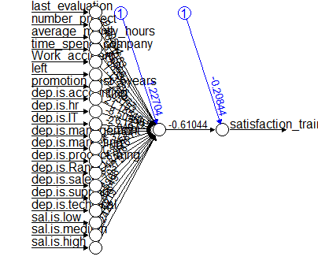

Course 02450 - Introduction to Machine Learning Project 2 - Supervised Learning: Classification and Regression Human Resources Analytics
================
04 April 2017

-   [1 Introduction](#introduction)
-   [2 Regression](#regression)
-   [3 Classification](#classification)

1 Introduction
==============

The dataset to be analyzed for this report is Human Resources data from Kaggle. It is a simulated dataset without containing any missing values or outliers. It contains 14999 observations that are employees of a company and has 10 variables describing the characteristics of these employees. These characteristics are shown in the table below:

<table>
<colgroup>
<col width="23%" />
<col width="57%" />
<col width="18%" />
</colgroup>
<thead>
<tr class="header">
<th align="center">Variable Name</th>
<th align="center">Description</th>
<th align="center">Type</th>
</tr>
</thead>
<tbody>
<tr class="odd">
<td align="center">Satisfaction Level</td>
<td align="center">Level of satisfaction of the employee</td>
<td align="center">Continous, ratio</td>
</tr>
<tr class="even">
<td align="center">Last evaluation</td>
<td align="center">Evaluation of employee performance</td>
<td align="center">Continous, ratio</td>
</tr>
<tr class="odd">
<td align="center">Number Project</td>
<td align="center">Number of projects completed while at work</td>
<td align="center">Discrete, ratio</td>
</tr>
<tr class="even">
<td align="center">Average monthly hours</td>
<td align="center">Average monthly hours at workplace</td>
<td align="center">Discrete, ratio</td>
</tr>
<tr class="odd">
<td align="center">Time spend company</td>
<td align="center">Number of years spent in the company</td>
<td align="center">Discrete, ratio</td>
</tr>
<tr class="even">
<td align="center">Work accident</td>
<td align="center">Whether the employee had an accident or not</td>
<td align="center">Discrete, nominal</td>
</tr>
<tr class="odd">
<td align="center">Promotion last 5years</td>
<td align="center">Whether the employee was promoted in the last five years</td>
<td align="center">Discrete, nominal</td>
</tr>
<tr class="even">
<td align="center">Left</td>
<td align="center">Whether the employee left the workplace or not</td>
<td align="center">Discrete, nominal</td>
</tr>
<tr class="odd">
<td align="center">Department</td>
<td align="center">Departments in the company</td>
<td align="center">Discrete, nominal</td>
</tr>
<tr class="even">
<td align="center">Salary</td>
<td align="center">Salary level of the employee</td>
<td align="center">Discrete, ordinal</td>
</tr>
</tbody>
</table>
The aim of the project is to analyze data using supervised learning methods using regression and classification. The regression models will try to estimate the satisfaction level of an employee whereas the classification models will try to predict whether an employee will leave the company or not.

The satisfaction level is a continous variable as can be seen in the above table and is a good metric for any company's HR department to be able to estimate if the employee is happy or not. Satisfaction level had also the highest correlation to whether an employee will leave the company or not, which came out as an observation from the first project. The "left" variable is a binary variable which will be used as the variable to be predicted by the classification models as it's the most important variable from a company's HR department perspective. It can be used as a decisive tool if the HR department can predict the employees' tendency to leave the company and can take precautions on time.

For the regression part of the project, linear regression and artificial neural network methods are going to be used and will be compared to the base model which will be the average satisfaction level of all the employees. The models are expected to decrease error significantly. For classification part of the project logistic regression, decision trees and k-nearest neighbour methods are going to be implemented. In this part, the base case will be taken assuming all the employees will leave the company. Again, the models are expected to decrease generalization error significantly.

In both parts of the project, two level cross-validation is going to be used for the analyzed data set. Inner level will optimize the model parameters whereas outer level will compare the generalization error between the models. Due to lack of computational power, the regression part will randomly sample 500 observations from the whole dataset, will use 5-fold crossvalidation in the inner level and 3-fold crossvalidation in the outer level. This sampling size is expected to have high error rates for the regression models. The classification part will use the whole dataset but again due to lack of computational power, 3-fold cross validation will be used in the inner level and holdout crossvalidation will be used in the outer level.

The dataset contains categorical variables which need to be included in both parts so one-out-of-k coding will be used to transform these variables into several binary variables. Then the whole data set will be scaled and the categorical variables that have more than two levels will be penalized by dividing by the square root of the number of categories to eliminate their bias in the analyses.

2 Regression
============

The regression problem we are trying to solve is the satisfaction level of the employee based on the other variables in our dataset. Two different methods will be applied to the sampled data for the satisfaction level estimation; linear regression and artificial neural networks.

The first model implemented was the artificial neural networks. The parameter we are trying to optimize for this model is the number of hidden nodes. The network model is executed in each inner cross validation fold for the number of hidden nodes optimization. The sum of squared error is calculated for models with different hidden nodes and the average error in each hidden node is plotted. The node giving the minimum test error was picked as the calculated node to be used in the outer cross validation level. As there are three outer cross validation folds in the outer level, there are three plots showing the sum of squared error vs the number of hidden nodes.

According to the sum of squares test error for the number of hidden nodes in each outer crossvalidation fold, the number of nodes for the ANN model was chosen as 1. This is an unexpected outcome as ANN model should have been performing with higher number of nodes but the low computational power for this analysis isn't sufficient to make a larger analysis. The loss of complexity in the model is sacrificed for time necessary to make further analysis. The best ANN model fit can be seen in the below graph.

<!-- -->

The second model implemented was the linear regression.For this model, in the inner level of crossvalidation folds, we are trying to optimize the number of parameters by forward feature selection. The function used in the exercise sessions were taken for forward feature selection. As 3 fold crossvalidation is used in the outer level, three models with different choices of features were created and plotted in the below graph.

As can be seen from the plot, the number of projects and the left variables were chosen for all three models, whereas the last evaluation variable was chosen for two of the models. While determining the final regression model, including these three variables into the final linear regression model would minimize the error.

The sum of squared errors were collected for each outer crossvalidation loop and then divided by the number of test observations to obtain the mean sum of squared errors. They can be seen in the below plot which can give an indication when comparing the regression model performance: 

It can be seen from the above graph that the models improved the performance compared to the base model. When linear regression model is compared to the ANN model, it showed a lower error rate. This should have been an unexpected result in general, but in our case with small sample size, low number of hidden nodes and low number of trials because of low computationa power, this result could be taken as expected. Another aspect of the result is the high error rate even for our best model. It shows an error rate around 80% which means that the results of the model aren't very reliable in determining the satisfaction level of an employee. The data doesn't seem to be suitable for a linear model for regression analysis.

A student's t-test is performed with a message to be shown for model comparison. If the two models differ by a significance of 5%, then a text statement is triggered to state that they are significantly different.

\[1\] "Regression models are NOT significantly different"

The t-test states that the models are not significantly different which means that they can behave similarly and give similar results for the data samples provided in the future.

3 Classification
================

The classification problem we would like to address is to predict whether an employee would leave the company or not, which has been provided as a binary variable in our dataset. It's the "left" variable in our dataset which specifies either employee left or stayed at the company.

Three different classification methods will be applied to the dataset for prediction and they are decision trees, logistic regression and k-nearest neighbours with two levels of cross validation applied to each model. The inner level of cross validation will finetune the model parameters and the outer cross validation level will estimate the generalization error. The ideal solution would be to have at least 10-fold cross validation for inner and outer loops but we have 15000 obsevations and we are lacking the computational power to analyze whole our data with that many levels. So instead, we decided to apply 3-fold cross validation for the inner loop and holdout cross validation for the outer loop to save time for the computation process.

In the below graphs, the error is calculated for each model in each inner cross validation fold for the parameters we are trying to finetune. Then they are averaged over the 3 cross validation folds and plotted for each outer cross validation fold. As we have holdout cross validation for the outer cross validation level, there are two seperate groups of plots.

The parameter we are trying to finetune for decision tree method is the pruning level whereas it is the number of neighbours for k-nearest neighbour method and finally it's the regularization constant for the logistic regression. They are plotted as the x-axes of each plot.

For decision tree modeling, the "rpart" package was used and for k-nearest neighbour modeling, the "FNN" package was used. However, for logistic regression modeling, the "glm" package was not sufficient for running different values of the regularization parameter so for logistic regression, the "glmnet" package was used where it was made possible to assign a range of lambda values to the logistic regression model.

The errors for each model have been calculated and they are plotted as boxplots in the below graph to be able to compare the error rate in order to determine the best classifier. The base case is also plotted where all the employees are assumed to have left the company so that we could see if the model would provide any improvement.

As we used holdout cross validation for the outer level, there are only two error observations plotted for each model in the boxplots which makes it harder to determine. Nevertheless, it can be seen that the decision tree model and the k-nearest neighbour model give the lowest error rate and show significant improvement compared to the base case.

In order to statistically compare the performance of these two best models, a paired t-test is applied to the error sets of these two models. If they differ by a significance of 5%, then a text statement is triggered to state that they are significantly different.

    ## [1] "Classifiers are NOT significantly different"

As stated above, the decision tree model and the k-nearest neighbour model are not statistically different. Nevertheless, the model with the lowest error rate, which is the decision tree, is plotted in the below graph with the optimized pruning level.

