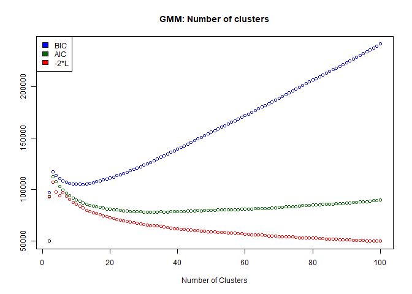
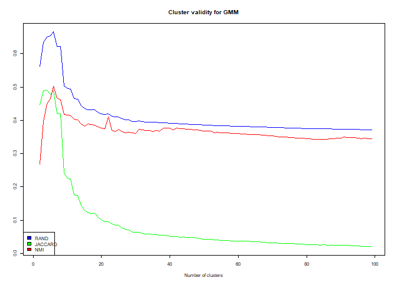
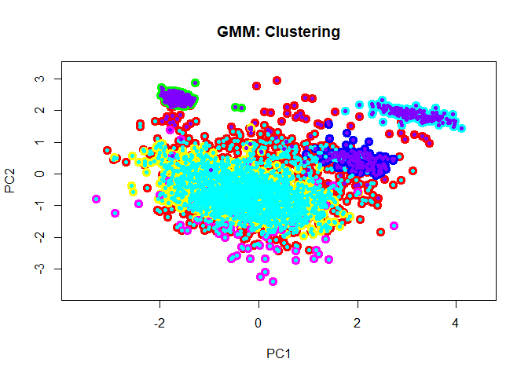
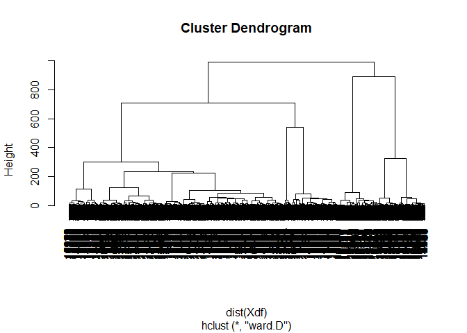
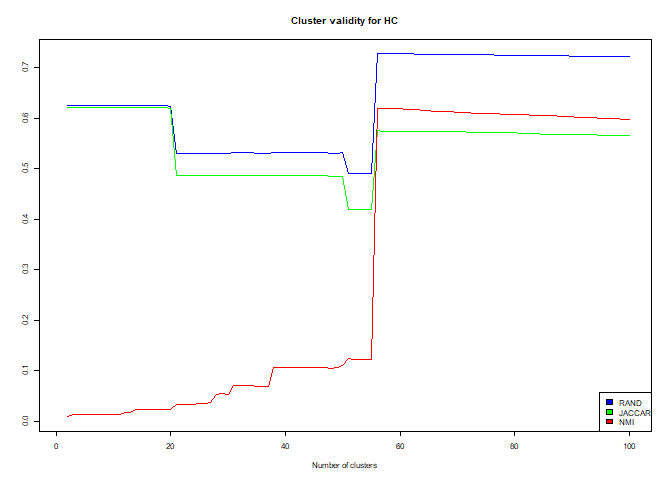

Course 02450 - Introduction to Machine Learning Project 3 - Unsupervised Learning Human Resources Analytics
================
01 May 2017

1 Introduction
==============

The dataset to be analyzed for this report is Human Resources data from Kaggle. It is a simulated dataset without containing any missing values. It contains 14999 observations of variables regarding characteristics of employees in a hypothetic company. The dataset contains 10 variables describing each employee:

<table>
<colgroup>
<col width="23%" />
<col width="57%" />
<col width="18%" />
</colgroup>
<thead>
<tr class="header">
<th align="center">
Variable Name
</th>
<th align="center">
Description
</th>
<th align="center">
Type
</th>
</tr>
</thead>
<tbody>
<tr class="odd">
<td align="center">
Satisfaction Level
</td>
<td align="center">
Level of satisfaction of the employee
</td>
<td align="center">
Continous, ratio
</td>
</tr>
<tr class="even">
<td align="center">
Last evaluation
</td>
<td align="center">
Evaluation of employee performance
</td>
<td align="center">
Continous, ratio
</td>
</tr>
<tr class="odd">
<td align="center">
Number Project
</td>
<td align="center">
Number of projects completed while at work
</td>
<td align="center">
Discrete, ratio
</td>
</tr>
<tr class="even">
<td align="center">
Average monthly hours
</td>
<td align="center">
Average monthly hours at workplace
</td>
<td align="center">
Discrete, ratio
</td>
</tr>
<tr class="odd">
<td align="center">
Time spend company
</td>
<td align="center">
Number of years spent in the company
</td>
<td align="center">
Discrete, ratio
</td>
</tr>
<tr class="even">
<td align="center">
Work accident
</td>
<td align="center">
Whether the employee had an accident or not
</td>
<td align="center">
Discrete, nominal
</td>
</tr>
<tr class="odd">
<td align="center">
Promotion last 5years
</td>
<td align="center">
Whether the employee was promoted in the last five years
</td>
<td align="center">
Discrete, nominal
</td>
</tr>
<tr class="even">
<td align="center">
Left
</td>
<td align="center">
Whether the employee left the workplace or not
</td>
<td align="center">
Discrete, nominal
</td>
</tr>
<tr class="odd">
<td align="center">
Department
</td>
<td align="center">
Departments in the company
</td>
<td align="center">
Discrete, nominal
</td>
</tr>
<tr class="even">
<td align="center">
Salary
</td>
<td align="center">
Salary level of the employee
</td>
<td align="center">
Discrete, ordinal
</td>
</tr>
</tbody>
</table>
The main aim of is to utilize unsupervised learning to discover underlying structures of the data. The first part is clustering methods like the Gaussian Mixture Model (GMM) and the hieratical clustering which clusters the data according to similarity. Other methods rely upon density of the data which is utilized to detect outlier. The last part of this project consists of association rule mining using the apriori-algorithm which is based upon probability.

2 Clustering
============

Unsupervised machine learning methods are used to identify clusters in the dataset much like the phylogenetic trees on biology. Our human resources dataset was normalized and the ordinal variables were penalized in one-out-of-k coding. 3000 random observations were sampled out to improve computational performance as the whole dataset took high amount of time to analyze.
The Gaussian mixture model (GMM) is a clustering method based upon a mixture of distributions. The expectation maximization algorithm (EM) was used to estimate the Page 4 of 37

parameters of GMM that maximizes the log-likelihood of the data. However, as a first step, the number of clusters to be used by the GMM needed to be determined using 10-fold cross validation. Bayesian information criteria (BIC), Akaike's information criteria (AIC) and the 2 times the log likelihood of observing the data were compared to define the best number of clusters. AIC and BIC values were used as a trade-off between minimizing the negative loglikelihood of the data and the model complexity but the decisive criteria was still the -2 times the negative log-likelihood which can be seen in the below graph:

The cross validation was run for cluster values between 2 and 100 resulting in corresponding values of BIC, AIC and -2-log. It can be seen that the AIC shows a lower increase compared to BIC which increases by a great amount as the number of clusters increase. The tendency of the red curve shows decrease beyond 100 clusters at the expense of a complex model which implies a hard fitting of the model. This many clusters will make it hard to analyze cluster centers and to realize relationships within the clusters. Furthermore, it will make it a very complicated process for an HR department to develop 100 different approaches to the people in a company. The resources needed for this approach will overwhelm the company budget. So, a cluster validity analysis was carried out for the GMM model to be able to determine a more reasonable number of clusters. The cluster validity was measured based on Rand statistic, Jaccard coefficient and the normalized mutual information (NMI). The scoring was performed for the number of clusters between 2 and 100 and below graph shows the three computed scores:

The blue line shows the rand statistic, the green line shows the Jaccard coefficient and the red line shows the NMI. Rand index shows the clusters are most stable when there are 6. The Jaccard coefficient shows 4 clusters as the best option and the NMI shows 6 clusters. When these measures are taken into consideration, it can be more reasonable to come up with 6 clusters as a result of GMM analysis instead of 100. It's as well a more realistic number to be able to carry the analysis and to be able to approach employees from an HR perspective where they can take precautions for clusters that are prone to leave the company. The cluster plot with 6 clusters can be seen in the below graph plotted along the axes of PC1 and PC2 which explained around 32% of the variance in our data according to the PCA analysis performed in the first project.

It can be seen that some of the clusters are incorporated into each other and it is not easy to distinguish individuals belonging to one cluster or the other as the distances between individual data points are small. Nevertheless it will be a more efficient model in contrast to using 100 clusters making it easier to come up with solutions regarding HR as explained before. Taking into consideration this observation, the second method to figure out the clusters in our dataset was decided to be done with hierarchical clustering using Ward's linkage function. The reason for this linkage function is caused by the data points in the clusters being too close to each other and varying sizes of clusters. Euclidean distance measure was used for the hierarchical clustering method. The number of clusters 6 was used as an input and the resulting graph can be seen below:

The cluster centers are more identifiable in the above graph but a similar cluster validity analysis to the GMM was carried out for the hierarchical clustering method which can be seen below:

